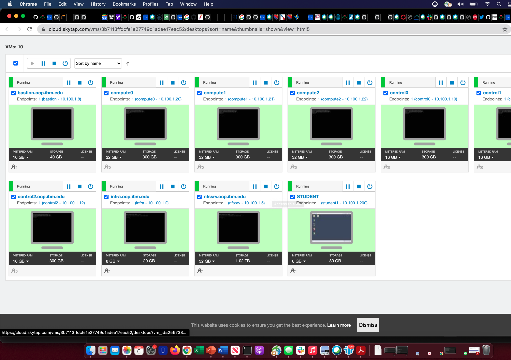
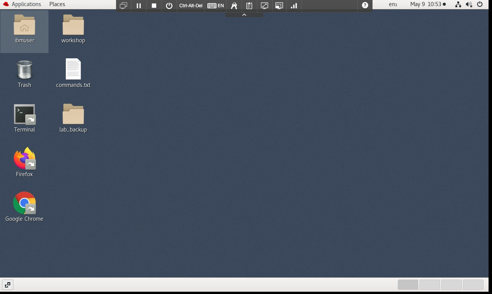
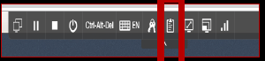
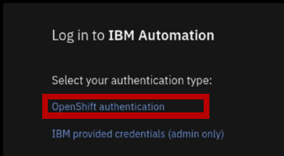
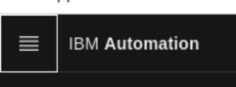
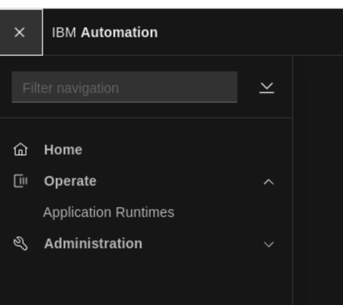
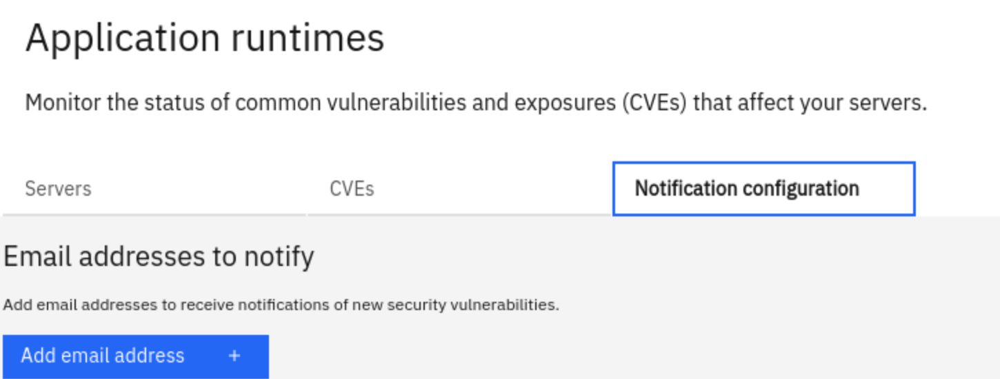
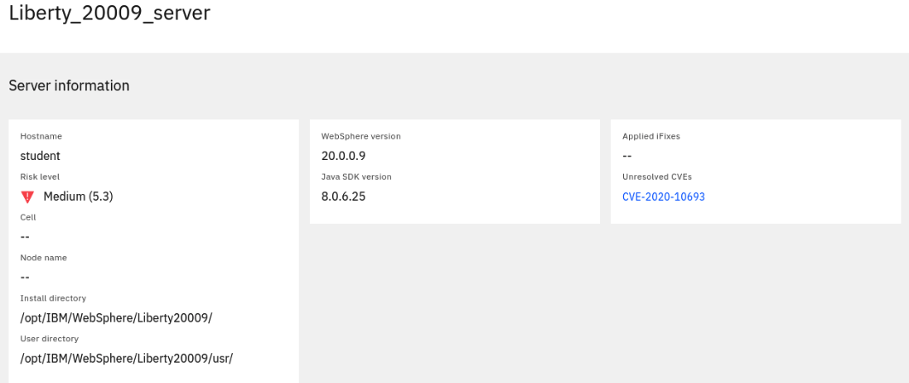

# ThinkLab-2257
IBM WebSphere Automation Think 2021 Lab instructions


## Lab Environment
-----------------
* Once you log in, you will see 10 VMs (virtual machines)
  * 3 are for lab infrastructure
  *	3 for OCP (OpenShift) controllers
  * 3 for OCP workers/compute
  *	1 for the lab (Student VM)
  
  
  
* WebSphere Automation is pre-installed in the OCP cluster hosted on the VMs.
* You will be working on the Student VM only.
  * This VM is installed with OCP client (oc) and all thee scripts and files you need for the lab.
  * All the WebSphere images and iFixes required for the lab are pre-installed
  	* /opt/IBM/WebSphere/Liberty200012/
	* /opt/IBM/WebSphere/Liberty20009/
	* /opt/IBM/WebSphere/AppServer9057/
    * /opt/IBM/WebSphere/AppServer9056/

## General Virtual Machine (VM) Usage Instructions
------------------------------------------------

* Once you log in to the Student VM you will see the Desktop, which contains all the programs that you will be using (browsers, terminal, etc.)

  

* The best way to copy and paste from slides is by using the clipboard at the top middle
  * Keyboard keys (like Ctrl ^C, Ctrl ^V) are not supported, so you have to highlight the text to copy and paste.
  	* Sometimes you might have to copy it twice to make this work.
  	
  
  


## High Level Steps
----------------

* [Step 1: Log in to WebSphere Automation GUI and configure your email to receive vulnerability notifications](#step-1--log-in-to-websphere-automation-gui-and-configure-your-email-to-receive-vulnerability-notifications)
* [Step 2: Log in as root on the Student VM and to OpenShift using OCP client (oc)](#step-2---log-in-as-root-on-the-student-vm-and-to-openshift-using-ocp-client-oc)
* [Step 3: Get the usageMetering configuration parameters (api-key, URL, server cert)](#step-3--get-usagemetering-configuration-parameters-url-api-key-cert)
* [Step 4: Configure Liberty Server version 20.0.0.12 to register to WebSphere Automation](#step-4--configure-liberty-server-version-20-0-0-12-to-register-to-websphere-automation)
* [Step 5: Configure Liberty Server version 20.0.0.9 to register to WebSphere Automation](#step-5--register-liberty-server-version-20-0-0-9-to-websphere-automation)
* [Step 6: Configure traditional WebSphere(tWAS) version 9.0.5.6 to WebSphere Automation](#step-6---configure-traditional-webspheretwas-version-9-0-5-6-to-websphere-automation)
* [Step 7: Configure traditional WebSphere(tWAS) version 9.0.5.7 to WebSphere Automation](#step-7--configure-traditional-webspheretwas-version-9-0-5-7-to-websphere-automation)
* [Step 8: Update Liberty server version 20.0.0.9 to fix the vulnerability](#step-8--update-liberty-server-version-20-0-0-9-to-fix-the-vulnerability) 
* [Step 9: Update tWAS server version 9.0.5.7 to fix the vulnerability](#step-9--update-twas-server-version-9-0-5-7-to-fix-the-vulnerability) 
* [Step 10: Update tWAS server version 9.0.5.7 to introduce the vulnerability back (optional)](#step-10-update-twas-server-version-9-0-5-7-to-introduce-the-vulnerability-back-optional)

### Step 1 – Log in to WebSphere Automation GUI and configure your email to receive vulnerability notifications
----------------------------------------------------------------------------------------------------------------

#### Access the GUI

* WebSphere Automation is pre-installed on an OCP cluster. 
* Each of you have access to your individual WebSphere Automation installation.
* Click the Student VM.
* Open a browser and enter the following URL:
  * `https://cpd-websphere-automation.apps.ocp.ibm.edu`
  * Accept all the warnings and certificates. Depending on your browser, you might have to scroll down to permit access.

#### Log in to the GUI

* This is the initial landing page for IBM automation
  * Under Log in to IBM Automation -> Select your authentication type: click OpenShift authentication
  
  
  
  * Enter the following credentials
    * UserName : ocadmin
    * Password : ibmocp46

#### Check GUI content and configure email notification

* Click the Navigation/Hamburger Menu on the left.

   

* Click Operate. 
  * You should now see Application Runtimes. Click that.
   
  
* It will take you to the WebSphere Automation GUI.
  * There should be no data since no WebSphere servers are registered/configured yet.
    
* On the console, go to Notification Configuration and enter your email address where you want to be notified about CVEs by clicking add email address button
  * The mail server is pre-configured for this lab. You only need to enter your email address to get notified.

   

### Step 2 - Log in as root on the Student VM and to OpenShift using OCP client (oc)
-----------------------------------------------------------------------------------

* Go back to the desktop and open 2 terminals. Log in as root in both:

```
su root
```

* Enter the following password when prompted:

```
1bm2021rhjb
```

* Log in to the OCP cluster (in each terminal) </br>
```
oc login --username=ocadmin --password=ibmocp46 --insecure-skip-tls-verify=true --server=https://api.ocp.ibm.edu:6443
```
* Make sure that the project you are working on is websphere-automation:</br>

```
oc project websphere-automation
```

### Step 3 – Get usageMetering configuration parameters (url, api-key, cert)
----------------------------------------------------------------------------

* Get the URL for usage-metering and save it in a file:
```
echo https://$(oc get route cpd -n websphere-automation -o jsonpath='{.spec.host}')/websphereauto/meteringapi > /opt/IBM/WebSphere/metering-url.txt
```
* Get the api-key and save it in a file.
```
oc -n websphere-automation get secret automation-secure-metering-apis-encrypted-tokens -o jsonpath='{.data.automation-secure-metering-apis-sa}' | base64 -d > /opt/IBM/WebSphere/api-key.txt; echo >> /opt/IBM/WebSphere/api-key.txt

```
* Get the Server certificate and save it in a file.
```
oc get secret external-tls-secret -n websphere-automation -o jsonpath='{.data.cert\.crt}' | base64 -d > /opt/IBM/WebSphere/cacert.pem

``` 

### Step 4 – Configure Liberty Server version 20 0 0 12 to register to WebSphere Automation
-------------------------------------------------------------------------------------------

* Create the Liberty server version 20.0.0.12:
```
/opt/IBM/WebSphere/Liberty200012/bin/server create Liberty_200012_server
```
* Configure the server to use TLS/SSL using the provided server_tls.xml file:
```
\cp -f /home/ibmuser/Desktop/lab_backup/liberty200012/server_tls.xml /opt/IBM/WebSphere/Liberty200012/usr/servers/Liberty_200012_server/server.xml

```

* Note the above command occasionally fails on the VM. Ensure that the two files are the same.
```
cmp /home/ibmuser/Desktop/lab_backup/liberty200012/server_tls.xml /opt/IBM/WebSphere/Liberty200012/usr/servers/Liberty_200012_server/server.xml && echo "files are the same, proceed to the next step"
```

* Start the Liberty server
```
/opt/IBM/WebSphere/Liberty200012/bin/server start Liberty_200012_server
```

* Update the DefaultKeyStore with the server certificate to trust the server for https connection:
```
keytool -import -trustcacerts -file /opt/IBM/WebSphere/cacert.pem -keystore /opt/IBM/WebSphere/Liberty200012/usr/servers/Liberty_200012_server/resources/security/key.p12 -storetype PKCS12 -storepass th1nkpassword -noprompt
```

* Edit the server.xml file (using vi, vim, or gedit) to add the `usageMetering-1.0` feature to the existing features in the `<featureManager>` element:
```
vi /opt/IBM/WebSphere/Liberty200012/usr/servers/Liberty_200012_server/server.xml
```
```
<feature>usageMetering-1.0</feature>
```

* Add the usageMetering element and replace the `<metering-url>` and the `<api-key>` values as shown below:
```
<usageMetering url="<metering-url>" apiKey="<api-key>" sslRef="defaultSSL"/>
```
* Replace `<metering-url>` above with the output of the  following cat command.Use the second terminal to run the cat command:
```
cat /opt/IBM/WebSphere/metering-url.txt
```
* Replace `<api-key>` above with the output of the following cat command.Use the second terminal to run the cat command:
```
cat /opt/IBM/WebSphere/api-key.txt
```

* Save the server.xml file.

* Confirm that the Liberty server is registered to WebSphere Automation:

  ```
  https://cpd-websphere-automation.apps.ocp.ibm.edu/websphereauto/secvul/
  ```
  
* This version of Liberty server is not vulnerable to any known CVEs
  * No email will be sent because there are no vulnerabilities
  
### Step 5 – Register Liberty Server version 20 0 0 9 to WebSphere Automation
---------------------------------------------------------------------------

* Create the Liberty server version 20.0.0.9:

```
/opt/IBM/WebSphere/Liberty20009/bin/server create Liberty_20009_server
```

* Since you have already configured usageMetering feature for Liberty version 20.0.0.12, we have a provided couple of server.xml files to make the configuration simpler. First copy the tls configuration:

```
\cp -f /home/ibmuser/Desktop/lab_backup/liberty20009/server_tls.xml /opt/IBM/WebSphere/Liberty20009/usr/servers/Liberty_20009_server/server.xml

```

* Note the above command occasionally fails on the VM. Ensure that the two files are the same.

```
cmp /home/ibmuser/Desktop/lab_backup/liberty20009/server_tls.xml /opt/IBM/WebSphere/Liberty20009/usr/servers/Liberty_20009_server/server.xml && echo "files are the same, proceed to the next step"
```

* Start the Liberty server:

```
/opt/IBM/WebSphere/Liberty20009/bin/server start Liberty_20009_server
```

* Update the DefaultKeyStore with the server certificate to trust the server for https connections:

```
keytool -import -trustcacerts -file /opt/IBM/WebSphere/cacert.pem -keystore /opt/IBM/WebSphere/Liberty20009/usr/servers/Liberty_20009_server/resources/security/key.p12 -storetype PKCS12 -storepass th1nkpassword -noprompt

```

* Copy the server.xml that contains the usageMetering feature and properties (url, api-key):

```
\cp -f /home/ibmuser/Desktop/lab_backup/liberty20009/server_configured.xml /opt/IBM/WebSphere/Liberty20009/usr/servers/Liberty_20009_server/server.xml

```

* Note the above command occasionally fails on the VM. Ensure that the two files are the same.

```
cmp /home/ibmuser/Desktop/lab_backup/liberty20009/server_configured.xml /opt/IBM/WebSphere/Liberty20009/usr/servers/Liberty_20009_server/server.xml && echo "files are the same, proceed to the next step"
```

* Confirm that the Liberty server is registered to WebSphere Automation

```
https://cpd-websphere-automation.apps.ocp.ibm.edu/websphereauto/secvul/

```

* The console shows that this server is vulnerable for CVE-2020-10693

* Check your email. A mail notification (if configured) will be sent indicating the vulnerability:

  * In the email message, there will be a link that would redirect to the console to show more details on the vulnerability. Because of network restrictions in the lab environment, this link will not work.
    
   * The image below is where the link would have redirected to.
   
   


### Step 6 - Configure traditional WebSphere(tWAS) version 9 0 5 6 to WebSphere Automation
------------------------------------------------------------------------------------------

* Start the tWAS 9.0.5.6 server:

```
/opt/IBM/WebSphere/AppServer9056/bin/startServer.sh tWAS_9056_server

```

* Configure usage-metering:

```
/opt/IBM/WebSphere/AppServer9056/bin/wsadmin.sh -f /api-usagemetering/scripts/configuretWasUsageMetering.py url=$(cat /opt/IBM/WebSphere/metering-url.txt) apiKey=$(cat /opt/IBM/WebSphere/api-key.txt) trustStorePassword=th1nkpassword

```

* Confirm that the tWAS server is registered to WebSphere Automation

```
https://cpd-websphere-automation.apps.ocp.ibm.edu/websphereauto/secvul/
```

* You should see that this server is vulnerable to 8 CVEs

* Check your email. A mail notification (if configured) will be sent showing the vulnerability

### Step 7 – Configure traditional WebSphere(tWAS) version 9 0 5 7 to WebSphere Automation
------------------------------------------------------------------------------------------

* Start the tWAS 9.0.5.7 server:

```
/opt/IBM/WebSphere/AppServer9057/bin/startServer.sh tWAS_9057_server
```

* Configure usage-metering:

```
/opt/IBM/WebSphere/AppServer9057/bin/wsadmin.sh -f /api-usagemetering/scripts/configuretWasUsageMetering.py url=$(cat /opt/IBM/WebSphere/metering-url.txt) apiKey=$(cat /opt/IBM/WebSphere/api-key.txt) trustStorePassword=th1nkpassword
```

* Confirm that the tWAS server is registered to WebSphere Automation:

```
https://cpd-websphere-automation.apps.ocp.ibm.edu/websphereauto/secvul/
```

* You should see that this server is vulnerable to 1 CVE (CVE-2021-26296)

* Check your email. A mail notification (if configured) will be sent showing the vulnerability


### Step 8 – Update Liberty server version 20 0 0 9 to fix the vulnerability
----------------------------------------------------------------------------

#### By updating configuration

* Liberty 20.0.0.9 is impacted by CVE-2020-10693. This is because it configures the beanValidation-2.0 feature.

See [CVE-2020-10693](https://www.ibm.com/support/pages/node/6348216) for more info.

* We should resolve this by applying the iFix. However, for the lab, we can also do a quick test by unconfiguring this feature:

```
vi /opt/IBM/WebSphere/Liberty20009/usr/servers/Liberty_20009_server/server.xml
```
or 

```
gedit /opt/IBM/WebSphere/Liberty20009/usr/servers/Liberty_20009_server/server.xml
```
  * Comment out the feature:
  ```
  <!-- <feature>beanValidation-2.0</feature> -->
  ```

* Save the server.xml file. 
   
* Go to console to make sure that the Liberty 20.0.0.9 server does not show any vulnerabilities. The update is picked up automatically.

```
https://cpd-websphere-automation.apps.ocp.ibm.edu/websphereauto/secvul/
```

#### By Applying an IFIX
------------------------

* Instead of removing the beanValidationFeature-2.0, the correct process is to apply the appropriate iFix to get rid of the vulnerability:

```
vi /opt/IBM/WebSphere/Liberty20009/usr/servers/Liberty_20009_server/server.xml

```

or

```
gedit /opt/IBM/WebSphere/Liberty20009/usr/servers/Liberty_20009_server/server.xml

```
  * Uncomment out the feature:
  ```
  <feature>beanValidation-2.0</feature>
  ```

* Save the server.xml file.

* Make sure the vulnerability shows up again. An email will also be sent out.

```
https://cpd-websphere-automation.apps.ocp.ibm.edu/websphereauto/secvul
```

* Stop the server:

```
/opt/IBM/WebSphere/Liberty20009/bin/server stop Liberty_20009_server
```

* Apply the iFix:

```
/iFix/PH29942/imcl_ifix_install.sh 20009
``` 

* Start the server:

```
/opt/IBM/WebSphere/Liberty20009/bin/server start Liberty_20009_server
```

* Now, in your console you should notice that the CVE was removed:

```
https://cpd-websphere-automation.apps.ocp.ibm.edu/websphereauto/secvul/
```

### Step 9 – Update tWAS server version 9 0 5 7 to fix the vulnerability
------------------------------------------------------------------------

* Notice in the console that tWAS 9.0.5.7 is vulnerable to CVE-2021-26296. We will fix it by applying the appropriate iFix.

* First, stop the server, wait until it has stopped:

```
/opt/IBM/WebSphere/AppServer9057/bin/stopServer.sh tWAS_9057_server
```

* Run the following script to install the iFix:

```
/iFix/PH34711/imcl_ifix_install.sh 9057
```

* Start the server once the installation has completed:

```
/opt/IBM/WebSphere/AppServer9057/bin/startServer.sh tWAS_9057_server
```
* Go back to the console. Notice that there are no more CVEs under tWAS 9.0.5.7.Also, you can see on the right under "Applied iFixes" there are 4 applied fixes.

```
https://cpd-websphere-automation.apps.ocp.ibm.edu/websphereauto/secvul/
```

### Step 10: Update tWAS server version 9 0 5 7 to introduce the vulnerability back (optional)
----------------------------------------------------------------------------------------------

* You can remove the iFix that was applied to confirm that the CVE-2021-26296 shows up in the unresolved CVE list

* Stop the server:

```
/opt/IBM/WebSphere/AppServer9057/bin/stopServer.sh tWAS_9057_server
```

* Uninstall the iFix:
```
/iFix/PH34711/imcl_ifix_uninstall.sh 9057
```

* Start the server:

```
/opt/IBM/WebSphere/AppServer9057/bin/startServer.sh tWAS_9057_server
```

* Go back to the console. Notice that there is now again 1 CVE under the tWAS 9.0.5.7 server:

```
https://cpd-websphere-automation.apps.ocp.ibm.edu/websphereauto/secvul/
```

* Check your email. A mail notification (if configured) will be sent showing the vulnerability.
